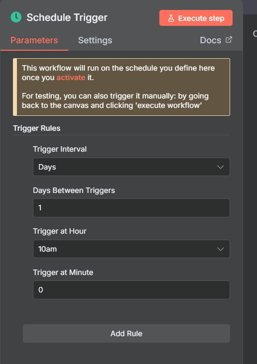
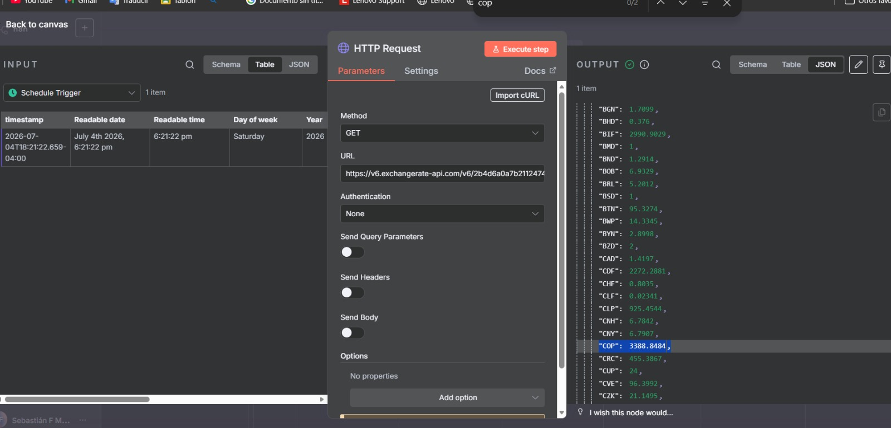
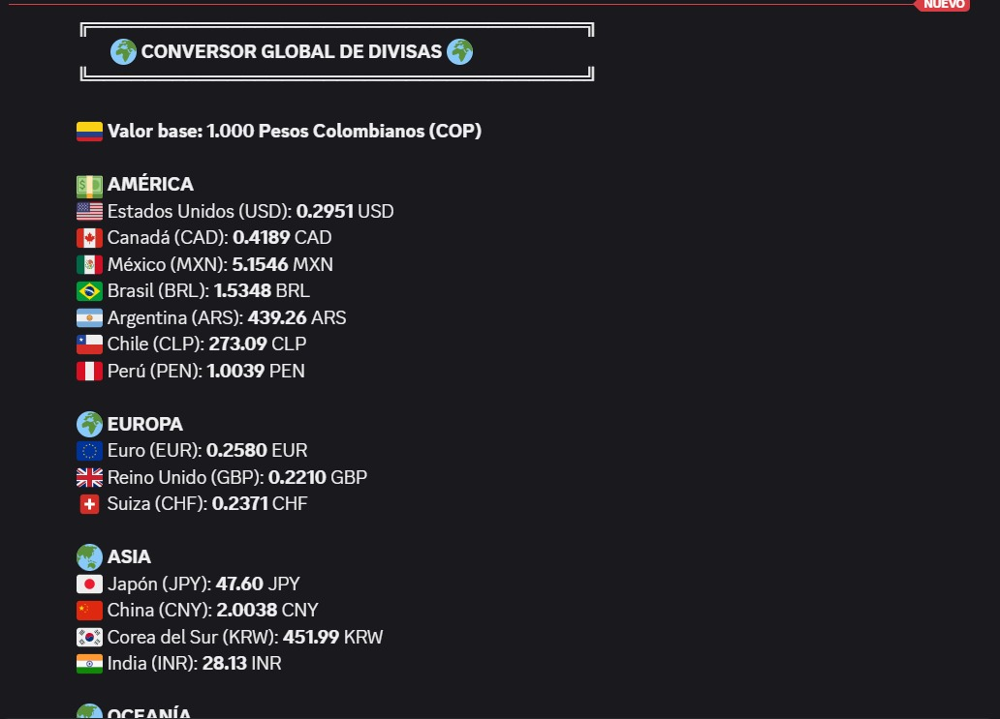
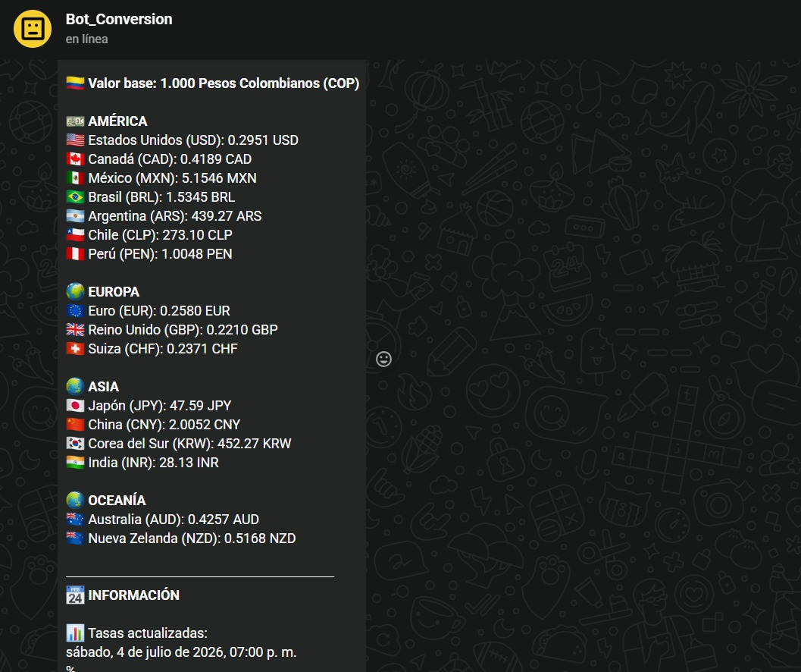
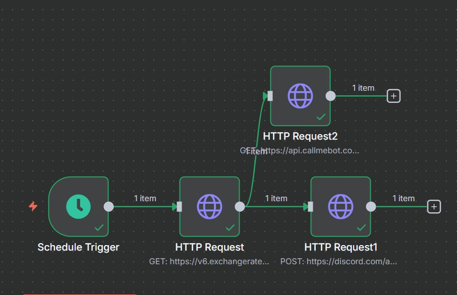

# Conversor Global de Divisas con n8n

## Reto Práctico #1 - Automatización con n8n

### Integrantes

- Sebastián F Murillo.
- Heiling leon

---

# Descripción del proyecto

Este proyecto consiste en la construcción de un **workflow automatizado en n8n** capaz de consultar diariamente las tasas oficiales de cambio mediante una API pública, realizar conversiones desde **Pesos Colombianos (COP)** hacia diferentes monedas internacionales y enviar automáticamente el resultado tanto a **Discord** como a **WhatsApp**.

El flujo fue desarrollado utilizando nodos de automatización, consumo de APIs REST, solicitudes HTTP y expresiones dinámicas de n8n.

---

# Objetivo

Automatizar el proceso de consulta de tasas de cambio internacionales y enviar un reporte diario de conversiones desde **1.000 COP** hacia las principales monedas del mundo.

---

# Problema

Consultar manualmente las tasas de cambio diariamente puede resultar repetitivo y poco práctico.

Con este workflow se automatiza completamente el proceso:

- Consulta automática de las tasas oficiales.
- Conversión inmediata desde COP.
- Organización de las divisas por continentes.
- Envío automático a Discord.
- Envío automático a WhatsApp.
- Ejecución diaria sin intervención del usuario.

---

# Investigación realizada

Durante el desarrollo del proyecto fue necesario investigar diferentes tecnologías y conceptos.


## APIs REST

Una API REST permite que diferentes aplicaciones intercambien información mediante solicitudes HTTP.

En este proyecto se utilizó una API pública para obtener las tasas oficiales de cambio.


---

## Expresiones dinámicas

Las expresiones dinámicas permiten realizar operaciones matemáticas directamente dentro de n8n.

Por ejemplo, para convertir 1000 COP a dólares:

```
1000 / {{$node["HTTP Request"].json.conversion_rates.COP}}
```

De igual manera se realizó la conversión para todas las demás monedas.

---

## Discord Webhooks

Discord permite recibir mensajes automáticamente mediante Webhooks.

El workflow envía un mensaje completamente formateado utilizando Markdown para mostrar la información organizada.

---

## WhatsApp (CallMeBot)

También se investigó la API gratuita de CallMeBot para enviar automáticamente el mismo reporte mediante WhatsApp.

Esta integración permitió que el workflow enviara la información a dos plataformas diferentes.

---

#  APIs utilizadas

## ExchangeRate API

Se utilizó para obtener las tasas oficiales de cambio.

```
https://v6.exchangerate-api.com/
```

Endpoint utilizado:

```
https://v6.exchangerate-api.com/v6/API_KEY/latest/USD
```

---

## Discord Webhook

Se utilizó un Webhook para enviar automáticamente el mensaje al canal de Discord.

Método:

```
POST
```

---

## CallMeBot API

Se utilizó para enviar automáticamente el reporte mediante WhatsApp.

Método:

```
GET
```

---

# Desarrollo paso a paso

## Paso 1

Se creó un **Schedule Trigger** configurado para ejecutarse automáticamente todos los días a las 10:00 AM.



---

## Paso 2

Se agregó un nodo **HTTP Request** encargado de consultar la API pública de ExchangeRate API.

Este nodo obtiene todas las tasas de cambio actualizadas.



---

## Paso 3

A partir de las tasas recibidas se realizaron las conversiones de **1000 Pesos Colombianos** hacia diferentes monedas utilizando expresiones dinámicas.

Las monedas seleccionadas fueron:

### América

- USD
- CAD
- MXN
- BRL
- ARS
- CLP
- PEN

### Europa

- EUR
- GBP
- CHF

### Asia

- JPY
- CNY
- KRW
- INR

### Oceanía

- AUD
- NZD

---

## Paso 4

Se construyó un mensaje organizado por continentes utilizando Markdown para mejorar la presentación en Discord.

El mensaje incluye:

- Valor base
- Conversión a múltiples monedas
- Fecha de actualización
- Fecha y hora del envío



---

## Paso 5

Se configuró un segundo HTTP Request para enviar exactamente el mismo reporte mediante la API de WhatsApp (CallMeBot).



---

## Paso 6

Finalmente se obtuvo el workflow completo funcionando con ambos envíos automáticos.



---

# Workflow implementado

El flujo desarrollado sigue el siguiente proceso:

```
Schedule Trigger
        │
        ▼
HTTP Request (ExchangeRate API)
        │
        ├────────► Discord Webhook
        │
        └────────► WhatsApp (CallMeBot)
```

---

# Resultado obtenido

El mensaje generado automáticamente muestra:

- Conversión desde 1000 COP.
- Monedas organizadas por continente.
- Nombre del país.
- Código ISO de la moneda.
- Fecha de actualización de la API.
- Fecha y hora del envío del mensaje.

Esto permite consultar rápidamente el valor aproximado de 1000 pesos colombianos frente a las principales monedas internacionales.

---


# Conclusiones

Este proyecto logró construir un workflow funcional en n8n que toma las tasas de cambio desde una API pública, convierte 1000 COP a varias monedas internacionales y entrega el resultado automáticamente en Discord y WhatsApp.

Durante el desarrollo se aplicaron expresiones dinámicas, solicitudes HTTP y procesado de datos JSON para automatizar el flujo y presentar la información de forma clara.

La solución muestra que n8n puede eliminar tareas manuales repetitivas, mantener la información siempre actualizada y ofrecer un proceso confiable para enviar reportes diarios de divisas.
